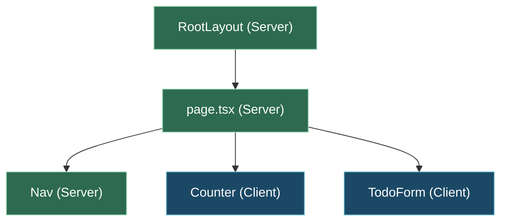

# lesson46: Server Component と Client Component

## ゴール

- Server Component と Client Component の違いを、動く場所と使える機能の観点で説明できる。
- `"use client"` を **ファイル先頭 1 行目** に書くルールを覚え、`import` された子にも Client 扱いが伝播することを理解できる。
- Client Component が Server Component を `import` はできないが、`children` や props として受け取れることを知っている。
- `console.log` をブラウザ / サーバーの両方で仕掛け、境界の違いを自分の目で確認できる。

## 解説

### 2 種類のコンポーネントがある

App Router では、コンポーネントが 2 種類ある。

- **Server Component**（デフォルト）
  - サーバー側で React を実行する。
  - `useState` / `useEffect` / `onClick` など、**ブラウザでしか動かないもの** は使えない。
  - データベースアクセスや秘密情報を扱える。
  - 送り出されたあとはブラウザでは再実行されない。
- **Client Component**
  - ブラウザで動く。章 4 までの React と同じ感覚で書ける。
  - `useState` / `useEffect` / `onClick` が使える。
  - 先頭に `"use client"` を書いて明示する。

章 4 と同じ感覚で `useState` を使いたい部品は Client Component に、静的に描画するだけの部品は Server Component に、というのが基本の使い分け。

### `"use client"` のルール

Client Component にしたいファイルは、**1 行目に** 次の 1 行を書く。

```tsx
"use client";

import { useState } from "react";

export function Counter() {
  // ...
}
```

- 必ず **ファイル先頭 1 行目**（`import` より上）。
- このファイルから `import` される子コンポーネントも、Server Component として書いてあっても **実質 Client 扱い** になる（Client 境界は import グラフに沿って伝播する）。

つまり「あるファイルに `"use client"` を書く」＝「そこから先はすべてブラウザ側で動く」と覚えればよい。

### 境界のイメージ

ページ全体を木に例えると、外側は Server Component（緑）、必要な葉だけが Client Component（青）というイメージになる。



- 図の緑（Server）は、アクセスごとにサーバー側で React が走って結果を送る部分。
- 図の青（Client）は、ブラウザに JS が届いて動く部分。
- Client の部分は「葉」に配置する。ページ全体を Client にしない。

上記図はダークモード前提で十分なコントラスト（背景 `#2d6a4f` / `#1b4965`、枠 `#95d5b2` / `#62b6cb`、文字 `#ffffff`）を指定している。

### Client → Server の呼び出しルール

ここがよく詰まるポイント。

- Client Component が Server Component を **`import` することはできない**。
- ただし、`children` や props として **受け取ること** は可能。

つまり、「Client の中に Server を入れたい」なら、**親 Server Component の側で組み立てて、Client の `children` に渡す** 形にすればよい。

```tsx
// Server Component（親）
import { ClientWrapper } from "./ClientWrapper";
import { ServerInfo } from "./ServerInfo";

export default function Page() {
  return (
    <ClientWrapper>
      <ServerInfo />
    </ClientWrapper>
  );
}
```

```tsx
// ClientWrapper.tsx
"use client";

import type { ReactNode } from "react";
import { useState } from "react";

export function ClientWrapper({ children }: { children: ReactNode }) {
  const [open, setOpen] = useState(false);
  return (
    <div>
      <button onClick={() => setOpen((o) => !o)}>開閉</button>
      {open && children}
    </div>
  );
}
```

`ClientWrapper` は自分では `ServerInfo` を `import` していないが、`children` として渡ってきた内容は Server Component として動ける。

### `"use client"` を忘れたときのエラー

`useState` を使うファイルで `"use client"` を書き忘れると、Next.js はビルド時にエラーを出す。実際に出るメッセージの一部は以下のような文言。

```
You're importing a component that needs useState. This React Hook only works in a Client Component. To fix, mark the file (or its parent) with the "use client" directive.
```

このメッセージが出たら、冒頭に `"use client";` を足せばすぐ直る。

## 演習

### 前回のプロジェクトを開く

lesson45 で作ったプロジェクトを開き直す。

### 手順 1: Client Component の `Counter` を作る

`app/` と同じ階層（または `app/` 内どこでも）に `components/` ディレクトリを新しく作って、そこに `Counter.tsx` を置く（本コースでは `app/components/` に置くことにする）。

`app/components/Counter.tsx`:

```tsx
"use client";

import { useState } from "react";

export function Counter() {
  const [count, setCount] = useState(0);
  console.log("client render");
  return (
    <div>
      <p>カウント: {count}</p>
      <button onClick={() => setCount((c) => c + 1)}>+1</button>
    </div>
  );
}
```

- 1 行目に `"use client"`。
- `useState` と `onClick` を使っている。
- `console.log("client render")` をレンダリング中に仕掛ける。

### 手順 2: Server Component の `page.tsx` に埋め込む

`app/page.tsx` を次のように書き換える。

```tsx
import { Counter } from "./components/Counter";

export default function Page() {
  console.log("server render");
  return (
    <>
      <h1>ようこそ</h1>
      <p>Counter は Client Component として動く。</p>
      <Counter />
    </>
  );
}
```

- `app/page.tsx` には `"use client"` を書かないので、これは Server Component。
- `console.log("server render")` を仕掛ける。

### 手順 3: 境界を確認する

1. ブラウザで `/` を開く。
2. ブラウザの DevTools → Console を開く。
3. StackBlitz 画面下部の **ターミナル** も見える状態にする（サーバー側ログが流れる場所）。
4. ページを再読み込みする。

#### 期待出力

- StackBlitz ターミナル側: `server render` が出る。ブラウザ Console には出ない。
- ブラウザ Console: `client render` が出る。ターミナル側にも 1 回だけ出る場合があるが、それはサーバー側で初回描画したときのログ（Client Component でも最初の HTML を出すために一度サーバー側でも走る）。
- カウンターの「+1」ボタンを押す → ブラウザ Console にだけ `client render` が追加で出続ける。ターミナル側には一切出ない（ボタン操作はサーバーに届かない）。

これで、**Server Component はサーバーで 1 回、Client Component は操作のたびにブラウザで** 動く、という境界の違いを目で確認できる。

### 手順 4: `"use client"` を消してみる

`app/components/Counter.tsx` の 1 行目 `"use client";` をコメントアウト、または削除して保存する。

ビルドが失敗し、ターミナルに次のようなエラーが出る（抜粋）。

```
You're importing a component that needs useState. This React Hook only works in a Client Component. To fix, mark the file (or its parent) with the "use client" directive.
```

このエラーが出たら、`"use client"` を書き戻して直す。Next.js は `useState` などを検知して「これは Client Component じゃないと動かないよ」と教えてくれる。

### 手順 5: Server を Client の children として渡す

以下の 2 ファイルを新しく作って、「Client の中に Server」の組み立てを体験する。

`app/components/ClientBox.tsx`:

```tsx
"use client";

import type { ReactNode } from "react";
import { useState } from "react";

export function ClientBox({ children }: { children: ReactNode }) {
  const [open, setOpen] = useState(true);
  return (
    <div>
      <button onClick={() => setOpen((o) => !o)}>
        {open ? "閉じる" : "開く"}
      </button>
      {open && <div>{children}</div>}
    </div>
  );
}
```

`app/components/ServerInfo.tsx`:

```tsx
export function ServerInfo() {
  // Server Component なので、ここでサーバー時刻が取れる
  const now = new Date().toISOString();
  return <p>サーバー時刻: {now}</p>;
}
```

`app/page.tsx` を書き換え、Server の `ServerInfo` を Client の `ClientBox` の `children` として渡す。

```tsx
import { Counter } from "./components/Counter";
import { ClientBox } from "./components/ClientBox";
import { ServerInfo } from "./components/ServerInfo";

export default function Page() {
  console.log("server render");
  return (
    <>
      <h1>ようこそ</h1>
      <Counter />
      <ClientBox>
        <ServerInfo />
      </ClientBox>
    </>
  );
}
```

#### 期待出力

- 最初は `サーバー時刻: 2026-...` が見えている。
- 「閉じる」ボタンで `ServerInfo` の表示が消える。「開く」で戻る。
- `ClientBox` は Client Component、中身の `ServerInfo` は Server Component、という組み合わせが成立している。

もし `ClientBox.tsx` の中で直接 `import { ServerInfo } from "./ServerInfo";` しようとすると、Server Component 側の機能（将来的に DB 呼び出しなど）は動かなくなる。**渡す** 形を使うのがコツ。

### 変えてみる

1. `ClientBox` の初期値を `useState(false)` に変えて、最初は閉じているようにする。
2. `ServerInfo` で取得する時刻を `new Date().toLocaleString("ja-JP")` に変える。

### 自分で書く

「ダークモード切り替えトグル」を Client Component で書いてみる。`useState<boolean>(false)` でオン／オフを持って、ボタンで切り替え、`<p>` に現在の状態を描画するだけでよい。それをトップページに足してみる。

## まとめ

- Server Component がデフォルト。Client Component にしたいファイルは 1 行目に `"use client"` と書く。
- `"use client"` のファイルから `import` された子は、書いた本人が気付かなくても Client 扱いに伝播する。
- Client Component は Server Component を `import` できないが、`children` や props として **受け取る** ことはできる。
- `console.log` の出方の違い（ターミナル vs ブラウザ Console）で境界を体感できる。
- 次の lesson47 では Server Component で実際にデータを `fetch` する。Client では扱いにくかった「サーバー側取得」のうまみを体験する。
