# lesson68: Server Actions の最小形

## ゴール

- `<form action={fn}>` に **関数** を渡してサーバー側で処理できることを理解します。
- `"use server"` の配置ルール（ファイル先頭 or 関数先頭、async 必須、Client 内には書けない）を覚えます。
- `FormData.get("...")` で送信値を取り出し、サーバー側の配列に追加できます。
- `revalidatePath` の仕組みを図で把握し、送信後に一覧が自動更新される流れを追えます。

## 解説

### `preventDefault` が要らなくなる

章 2 lesson29 では、素の JS で `<form>` の送信を止めるために `event.preventDefault()` を書きました。React（章 4）でも `onSubmit` の中で同じことをしていました。

React 19 + Next.js の `<form action={fn}>` に **関数** を渡すと、React が送信イベントを **自動で止めて** その関数を呼んでくれます。結果として、以下の対比になります。

| 書き方 | 送信のデフォルトを止める |
|---|---|
| lesson29 の素の JS | `event.preventDefault()` を手書き |
| lesson48 の React `onSubmit` | `e.preventDefault()` を手書き |
| **本レッスンの `<form action={fn}>`** | **React が自動で止める** |

`preventDefault` という呼び出しが消えることに注目しておきましょう。

### Server Actions とは

`<form action={fn}>` の `fn` に、**サーバー側で実行される関数** を渡せるのが **Server Actions** です。ブラウザ側のフォーム送信が自動で HTTP リクエストに包まれ、サーバーに届き、指定した関数が走ります。

- クライアント JS を書かなくても、サーバー側で値を受け取って処理できます。
- 戻り値はありません（あっても無視されます。戻り値を使いたいときは lesson69 の `useActionState`）。
- 関数は **必ず `async`** です。

### `"use server"` の配置ルール

Server Action であることを示すには、次のどちらかの場所に `"use server"` と書きます。

1. **ファイル先頭に書く**: そのファイル内で `export` されている **async 関数すべて** が Server Action になります。最もよく使う形です。
   ```ts
   // app/actions.ts
   "use server";

   export async function addTodo(formData: FormData) {
     // サーバー側で動く
   }

   export async function deleteTodo(id: string) {
     // これも Server Action
   }
   ```

2. **関数の先頭行に書く**: その関数だけが Server Action になります。Server Component の中にインラインで定義する場合に使います。
   ```tsx
   export default async function Page() {
     async function addTodo(formData: FormData) {
       "use server";
       // この関数だけ Server Action
     }
     return <form action={addTodo}>...</form>;
   }
   ```

ルール:

- **必ず async 関数** です。同期関数に `"use server"` は書けません。
- **Client Component の中（`"use client"` のファイル内）には書けません**。Client から使いたいときは、別ファイルで `"use server"` を書いて `import` します。
- `"use server"` を書いたファイルからの **`export` は async 関数だけ** にするのが安全です。値（普通の `const`）や非 async 関数を `export` するとビルド時に警告やエラーが出ることがあります。
- 例外として **型の `export type`** は問題ありません（TypeScript の型情報はビルド後の JS には残らないためです）。

本コースでは **(1) のファイル先頭パターン** を使います（分離が分かりやすいためです）。

### データの保存先（本コースでの割り切り）

本コースではデータベースは使いません。代わりに、`app/actions.ts` のモジュールトップレベルに **ただの配列** を置いて、擬似的な永続化とします。

**開発時（dev）の注意**: StackBlitz や `next dev` では、`app/actions.ts` を編集するたびにモジュールが再評価され、`const todos: Todo[] = []` が初期化し直されて中身が消えます。動作確認のコツは「**追加したら actions.ts を編集しない**」です。本物の永続化が必要な場合は DB を使うのが正攻法です。

```ts
// app/actions.ts
"use server";
import type { Todo } from "./types";

const todos: Todo[] = [];
```

- サーバーのプロセスが生きている間は `todos` が残ります（同じプロセス内の呼び出しは同じ配列を共有します）。
- **StackBlitz や Vercel でサーバーが再起動すると消えます**。本物の永続化には DB が必要ですが本コースでは扱いません（lesson75 末尾でも再度注意を書きます）。

### `revalidatePath` の仕組み

Server Component（例: `/todos` の `page.tsx`）は、描画結果がキャッシュされます。Server Action が配列を変更しても、そのままではキャッシュされた古い画面が残ります。

`revalidatePath('/todos')` を呼ぶと、そのパスのキャッシュが **無効化** されます。次にそのページに入る（またはアクション直後の自動再レンダリング）タイミングで Server Component が再実行され、最新の `todos` が描画されます。

```mermaid
sequenceDiagram
  participant Browser as ブラウザ
  participant Page as /todos page.tsx (Server)
  participant Action as addTodo (Server Action)
  participant Store as todos 配列

  Browser->>Page: アクセス
  Page->>Store: 配列を読む
  Store-->>Page: [] (空)
  Page-->>Browser: 空の一覧

  Browser->>Action: <form action> で送信
  Action->>Store: push(new)
  Action->>Page: revalidatePath('/todos')
  Note right of Page: キャッシュ無効化
  Action-->>Browser: 完了
  Browser->>Page: 再レンダリング(自動)
  Page->>Store: 配列を読む
  Store-->>Page: [new]
  Page-->>Browser: 更新された一覧
```



## 演習

### 前回のプロジェクトを開く

lesson67 で作ったプロジェクトを開き直しましょう。

### 手順 1: `Todo` 型を用意

章 3 で決めた `Todo` 型を、Next.js プロジェクトでも再利用します。`app/types.ts` を作ります。

```ts
export type Todo = {
  id: string;
  text: string;
};
```

### 手順 2: `app/actions.ts` を作る

先頭に `"use server"` を書きます。モジュールトップレベルに配列とアクションを書きます。

```ts
"use server";

import { revalidatePath } from "next/cache";
import type { Todo } from "./types";

const todos: Todo[] = [];

export async function listTodos(): Promise<Todo[]> {
  return todos;
}

// 戻り値の型（章 3 lesson38 の判別共用体そのもの）
export type AddTodoResult = { ok: true } | { ok: false; error: string };

export async function addTodo(formData: FormData): Promise<AddTodoResult> {
  const text = String(formData.get("text") ?? "").trim();
  if (text.length === 0) {
    return { ok: false, error: "空のままでは追加できません" };
  }
  todos.push({ id: crypto.randomUUID(), text });
  revalidatePath("/todos");
  return { ok: true };
}
```

ポイント:

- `"use server"` はファイルの **1 行目** に書きます。
- `const todos: Todo[] = []` が「永続化の代わり」です。サーバーが生きている間だけ保持されます。
- `addTodo` は `async` です。`FormData` から `formData.get("text")` で取り出します。
- `revalidatePath("/todos")` で `/todos` のキャッシュを無効化します。
- `crypto.randomUUID()` は Node.js 19+ / 最近のブラウザで使える ID 生成関数です。
- **戻り値の型 `AddTodoResult`** は、章 3 lesson38 で学んだ **判別共用体（discriminated union）** そのものです。`ok: true` と `ok: false` を `ok` というタグで識別します。この型は次の lesson69 で `useActionState` と結合するとき効きます。

### 手順 3: `/todos` を本物のページにする

`app/todos/page.tsx` を書き換えます。

```tsx
import { addTodo, listTodos } from "../actions";

export default async function TodosPage() {
  const todos = await listTodos();

  return (
    <>
      <h1>TODO 一覧</h1>
      <form action={addTodo}>
        <input type="text" name="text" placeholder="やることを入力" />
        <button type="submit">追加</button>
      </form>
      <ul>
        {todos.map((todo) => (
          <li key={todo.id}>{todo.text}</li>
        ))}
      </ul>
    </>
  );
}
```

ポイント:

- このファイルは Server Component です（`"use client"` を書きません）。
- `<form action={addTodo}>` に関数を直接渡しています。
- `event.preventDefault()` も `onSubmit` も書いていません。React が自動で止めます。
- `<input name="text">` の `name` 属性が `FormData.get("text")` のキーと一致しています（章 1 lesson06 で学んだ `name` 属性がここで効いています）。

### 期待出力

1. `/todos` を開くと、入力欄・追加ボタン・空の `<ul>` が見えます。
2. 「買い物」と入力して「追加」を押す → `<ul>` に「買い物」が 1 件追加されます。
3. 「課題」を入力して追加 → 2 件目として「課題」が追加されます。
4. ブラウザの DevTools → Network タブを見ると、送信時に POST が飛び、200 で返ってきています。
5. **リロードしても消えません**（サーバープロセスが生きているためです）。ただし StackBlitz を開き直したり、プロジェクトを再起動すると配列がリセットされ、すべて消えます。

### 変えてみる

1. `addTodo` の中で `console.log("addTodo", text)` を追加しましょう。StackBlitz のターミナル側にログが出ることを確認します（Server Actions はサーバーで動く証拠です）。
2. `revalidatePath("/todos")` をコメントアウトして、追加ボタンを押すとどうなるか試しましょう。一覧が更新されなくなります（手動で再読み込みすると更新されます）。確認したら戻します。
3. `<input>` の `placeholder` を自分の好きなテキストに変えましょう。

### スコープ外

- 送信中のボタン無効化、空入力エラー表示は **lesson69** で追加します。本レッスンでは最小形に集中します。
- `Todo` ごとの削除ボタンも本レッスンでは扱いません（lesson73 の統合で扱います）。

### 自分で書く

`/memo` という別ページを作り、`addMemo`（サーバー側に `const memos: string[] = []` を持つ）で「メモを追加して下に並べる」だけの最小アプリを作ってみましょう。`types.ts` や `actions.ts` は新しく別ファイルで作っても、既存の `actions.ts` に追記しても構いません。

## まとめ

- `<form action={fn}>` に関数を渡すと、React が自動で送信を止めて `fn` を呼びます。`preventDefault` は要りません。
- Server Actions の関数は **必ず async** です。`"use server"` はファイル先頭または関数先頭に書きます。Client Component 内には書けません。
- データは `app/actions.ts` のモジュールトップレベルの配列で保持します（StackBlitz / Vercel で再起動すると消えます）。
- `revalidatePath(path)` でその URL のキャッシュを無効化 → 次の描画で Server Component が再実行されます。
- 次の lesson69 では、送信中の状態表示とエラー表示を `useActionState` / `useFormStatus` で追加します。`addTodo` のシグネチャもそこで少し変えます。

### コラム: `revalidateTag`

`revalidatePath` はパス単位で無効化します。もっと細かく、「`fetch` にタグを付けておき、その **タグ** だけ無効化する」方法もあります。

```ts
// 読み込み側: タグを付ける
await fetch(url, { next: { tags: ["todos"] } });

// Server Action 側: タグで無効化
import { revalidateTag } from "next/cache";
revalidateTag("todos");
```

複数ページで同じデータを使っているときに便利です。本コースでは扱いませんが、実務では頻出です。
